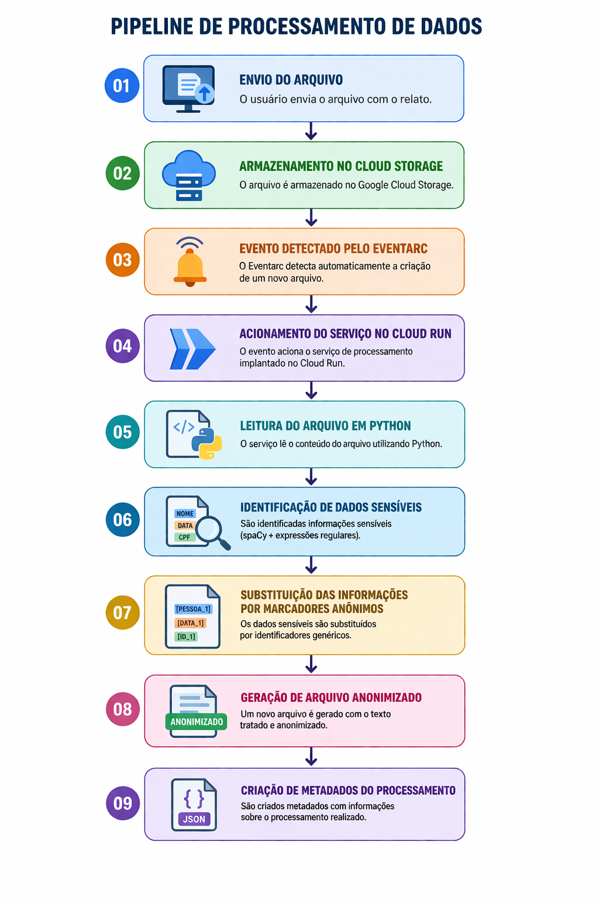

# Anonimizador de Relatos

Pipeline em nuvem para anonimização automática de relatos textuais contendo dados sensíveis.

## Tecnologias utilizadas

- Google Cloud Storage
- Eventarc
- Cloud Run
- Python
- spaCy
- Expressões regulares

## Arquitetura da solução

A solução utiliza uma arquitetura orientada a eventos.  
Quando um novo arquivo é enviado ao Cloud Storage, um evento é detectado pelo Eventarc que aciona um serviço executado no Cloud Run.  

O serviço realiza o processamento do texto, identifica dados sensíveis e gera uma versão anonimizada juntamente com os metadados do processamento.

## Arquitetura da Pipeline

## Estrutura do projeto

- `main.py` – lógica principal de processamento
- `requirements.txt` – dependências do projeto
- `docs/` – diagramas da arquitetura e pipeline

- ## Execução do projeto

1. Instale as dependências:

pip install -r requirements.txt

2. Configure as credenciais do Google Cloud.

3. Envie um arquivo de relato para o bucket configurado no Cloud Storage.

4. O sistema irá processar automaticamente o texto, anonimizar os dados sensíveis e gerar um novo arquivo juntamente com os metadados do processamento.

## Autor

Bruno Luiz Ferreira  
PUC Goiás – Escola Politécnica e de Artes  
